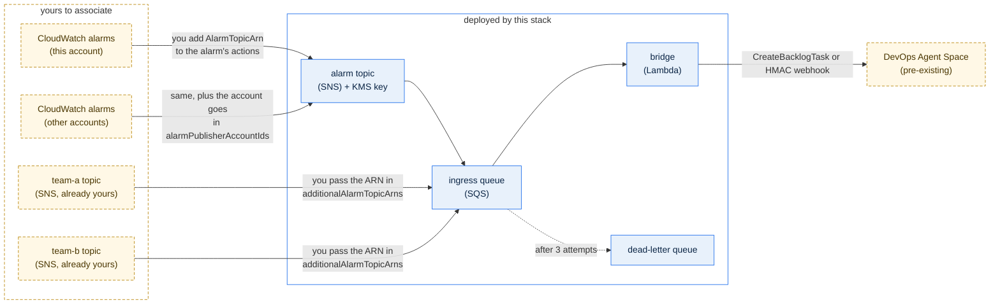

# investigate-alarms-with-ticket

Routes CloudWatch alarms into [AWS DevOps Agent](https://docs.aws.amazon.com/devopsagent/latest/userguide/)
to start an investigation. Alarms can be in any account or Region; the Agent Space is
regional, so point `DEVOPS_AGENT_REGION` at it.

Two delivery paths: `DELIVERY_MODE=api` (SigV4 `CreateBacklogTask`, no shared secret) or
`DELIVERY_MODE=webhook` (HMAC — the only path that can also fire a custom agent).

## Deploy

The stack attaches to an **existing** Agent Space — it never creates one. It deploys an SNS
ingress topic, an SQS ingress queue, the bridge function, a KMS key and a dead-letter queue.



```bash
cd cdk && npm ci
npx cdk bootstrap                        # once per account/Region
npx cdk deploy \
  -c agentSpaceId=<agent-space-id> \
  -c agentSpaceRegion=ap-southeast-1
```

Optional context, added to the same command as needed — `deliveryMode=webhook` with
`webhookSecretArn=<arn>` for webhook mode, `alarmPublisherAccountIds=111122223333,444455556666`
for alarms in other accounts, and `additionalAlarmTopicArns=<arn>,<arn>` to fan in topics you
already own.

Point alarms at the `AlarmTopicArn` output:

```bash
aws cloudwatch put-metric-alarm --alarm-name <name> ... --alarm-actions <AlarmTopicArn>
```

For alarms in other accounts, list those accounts in `alarmPublisherAccountIds` — the topic
and its KMS key are opened to `cloudwatch.amazonaws.com` pinned by `aws:SourceAccount` —
then set the same topic ARN as the alarm action over there.

To reuse topics you already have, pass them in `additionalAlarmTopicArns` rather than
re-pointing their alarms; each is subscribed to the ingress queue and its existing
subscribers are untouched. A topic in another account must allow this account to call
`sns:Subscribe`. Alarms cannot target SQS directly, so a topic — or an EventBridge rule —
stays the entry point. The handler also accepts EventBridge `CloudWatch Alarm State Change`
events and direct alarm-action invokes.

cdk-nag's AWS Solutions pack runs on every synth and fails the build on findings.

## Creating the webhook

Needed only for `webhook` mode. DevOps Agent calls this a **generic webhook**; the CLI
registers it as service type `eventChannel`. One HMAC webhook per Agent Space.

```bash
SPACE=<agent-space-id>; REGION=<agent-space-region>

SERVICE_ID=$(aws devops-agent register-service \
  --service eventChannel --service-details '{"eventChannel":{"type":"webhook"}}' \
  --region "$REGION" --query serviceId --output text)

# The response is the ONLY place the secret appears.
aws devops-agent associate-service --agent-space-id "$SPACE" --service-id "$SERVICE_ID" \
  --configuration '{"eventChannel":{}}' --region "$REGION" --query webhook

aws secretsmanager create-secret --name devops-agent-webhook --region "$REGION" \
  --secret-string '{"webhookUrl":"<url>","webhookSecret":"<secret>"}'
```

Console equivalent: Agent Space → **Capabilities** → **Agent Space Webhook** → **Add
webhook** → **HMAC** → download the CSV.

**Lost the secret?** It is never returned again by the console, API, or IaC. Rotate the
webhook (Capabilities → webhook → Actions → Edit → **Rotate**): same URL, new secret, old
one dead immediately — so update Secrets Manager in the same pass. The URL stays readable
via `list-associations` + `list-webhooks`.

**To run a custom agent** instead of an investigation, add an **Event trigger** on that
agent (Agents → agent → Triggers → Event) with the generic webhook as the event source.
Console-only: `CreateTrigger` accepts schedule conditions only. The dropdown stays empty
until the webhook above exists.

Verify with `npm run test:integration --prefix cdk`: a wrong signature must be rejected
4xx, a correct one must return 200. 200 means queued, not investigating — confirm new
payload shapes in the Operator Web App.

## Lambda environment

| Variable | Required | Notes |
| --- | --- | --- |
| `DELIVERY_MODE` | no | `api` (default) or `webhook` |
| `WEBHOOK_SECRET_ARN` | `webhook` mode | secret holding `webhookUrl` + `webhookSecret` |
| `AGENT_SPACE_ID` | `api` mode | |
| `DEVOPS_AGENT_REGION` | no | defaults to the function's own Region |
| `POWERTOOLS_LOG_LEVEL` | no | `INFO` keeps the full audit trail; `WARN` leaves only what needs action |

`api` mode needs `aidevops:CreateBacklogTask` on
`arn:aws:aidevops:<region>:<account>:agentspace/<agentSpaceId>`.

## Optional pre-loaded skills deployment

Skills change how the agent behaves, so they ship as their own stack, separate from the
pipeline. Deleting that stack removes them from the Agent Space.

```bash
cd cdk
AWS_REGION=<agent space region> npm run deploy:skills -- -c agentSpaceId=<id>
```

Every directory under `skills/` is uploaded, one asset per skill, each declaring its name,
description and agent types in its own `SKILL.md` frontmatter — read those to see what is
deployed. Deploy in the Agent Space's Region, since the skills are created there. Add
`-c skillsActive=false` to upload them inactive, for review before the agent loads them.

## Commands

```bash
cd cdk
npm run build            # tsc type-check (swc does not type-check during tests)
npm test                 # unit tests only, no AWS calls
npm test -- --coverage   # enforces the coverage floor in jest.config.js
npm run test:integration # live Agent Space; RUN_BILLABLE_TESTS=1 adds real investigations
npx tsx scripts/show-audit-records.ts   # print the audit records for every path, no AWS calls

npm run deploy:skills -- -c agentSpaceId=<id>   # upload every skill under skills/
npx cdk diff CustomSkillsStack -c enableCustomSkills=true -c agentSpaceId=<id>   # preview
```

`ALLOW_SUPPORT_ESCALATION_TEST=1` runs one more integration case that can end in a real AWS
Support case. It needs a Business, Enterprise or Unified Operations plan, and the
`production-critical-support-case` skill deployed.
